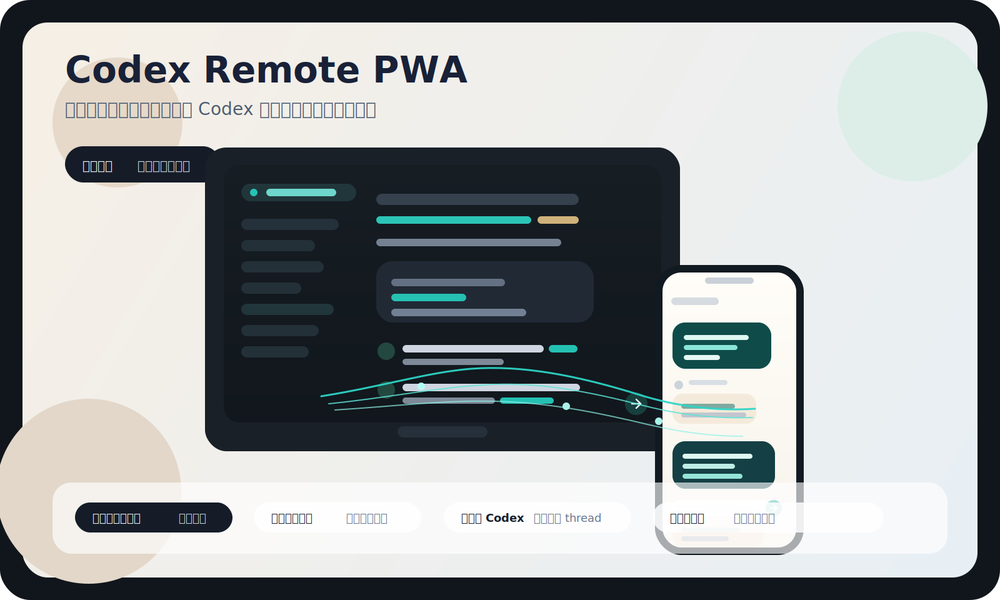
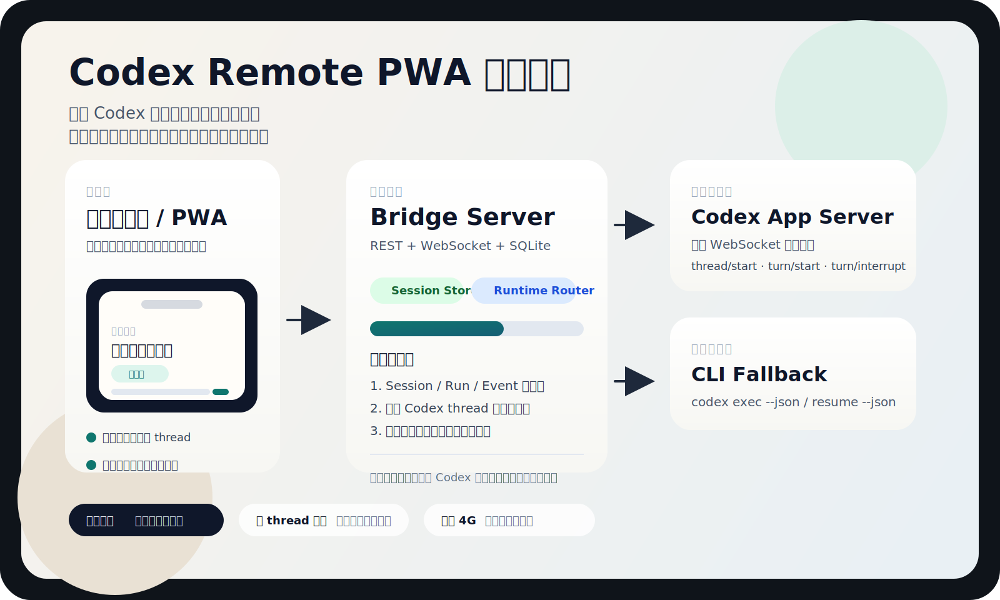
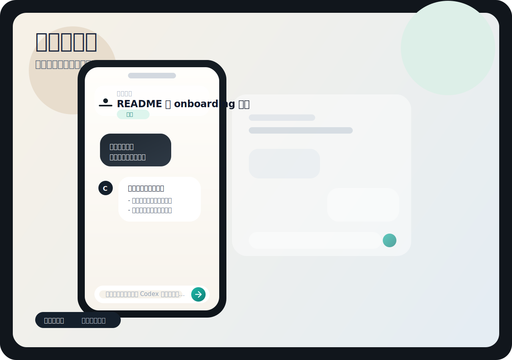
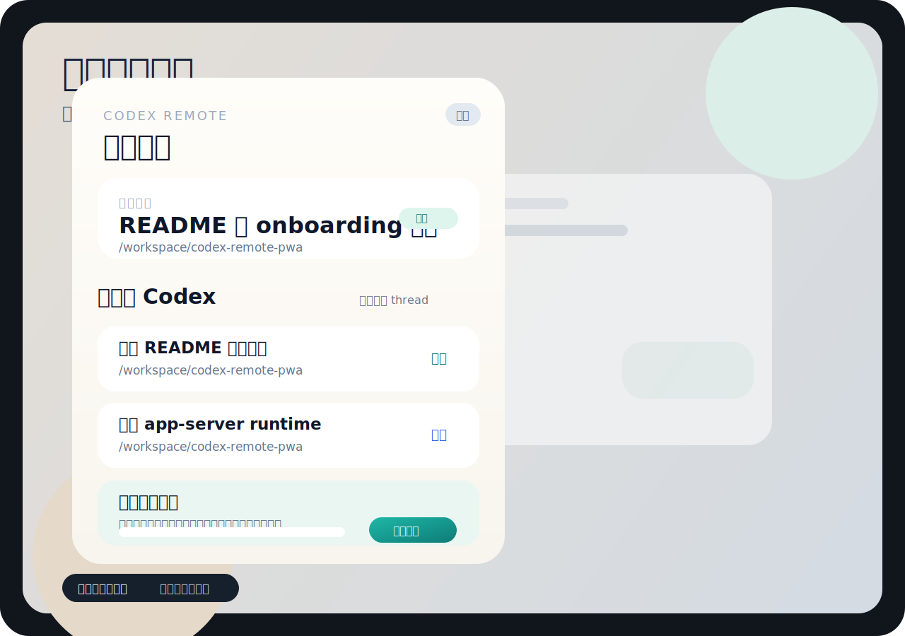

# Codex Remote PWA

[](https://github.com/wp-a/codex-remote-pwa/actions/workflows/ci.yml)

一个面向手机浏览器的 Codex 远程控制台。  
它不会把你的代码搬到云端，也不是远程桌面；真正的 Codex 会话仍然运行在你的本机，手机只是一个更轻的控制入口。

## 项目定位

这个项目解决的是一个很具体的问题：

- 你正在电脑上使用 Codex
- 你临时离开电脑，只带了手机
- 你想继续给同一个本地会话发任务
- 你想看最后输出、切换会话、处理中断或授权

`Codex Remote PWA` 就是为这个场景做的一个本地优先桥接层。



## 竞品对照

| 项目 | 擅长什么 | 不足或取舍 | `Codex Remote PWA` 的对照策略 |
| --- | --- | --- | --- |
| RemCodex | 面向 Codex 的远程继续对话、审批、中断体验直观 | 更偏产品成品，二次定制空间有限 | 保留“继续同一个本地会话”的核心体验，同时坚持自托管、本地优先 |
| OpenClaw | 多渠道 agent gateway，接入 Telegram / WhatsApp / Discord 的思路清晰 | 不聚焦“继续同一个本地 Codex thread” | 借鉴其低摩擦接入思路，用“手机打开链接”降低配对成本 |
| OpenHands | 开源包装成熟、README 和项目结构更完整 | 更偏通用开发 agent，不是手机优先 | 借鉴其开源项目表达方式，但聚焦一个更窄、更明确的场景 |

这个项目的定位因此很明确：

- 不做远程桌面
- 不做通用多平台代理
- 先把“手机继续你电脑上的 Codex 会话”这件事做深

## 图片预览

### 系统架构



### 聊天主界面



### 会话切换抽屉



## 这轮对照竞品后的优化

- `Onboarding`：在抽屉里新增“手机打开链接”，把当前地址和连接密码打包成一条可直接发到手机的链接
- `会话继续`：保留“最近的 Codex”入口，优先服务继续已有 thread，而不是重新新建机器人
- `开源表达`：重做 README 图片和结构，让项目定位、架构和边界更容易一眼看懂

## 当前能力

- 在手机端继续已有的 Codex 会话
- 查看最近导入的本地 Codex session
- 通过 WebSocket 实时接收最后输出
- 持久化 `session / run / event / approval`
- 支持两种运行时：
  - `codex app-server` WebSocket 运行时
  - `codex exec --json` CLI fallback
- 在手机端展示等待授权的动作

## 当前边界

- 手机端的授权动作目前已经可以显示和持久化
- 但还没有把“允许 / 拒绝”完整回写到上游 `codex app-server`
- 所以当前更适合：
  - 继续聊天
  - 查看输出
  - 切换会话
  - 观察授权请求

## 工作方式

```text
手机浏览器 / PWA
  -> REST + WebSocket bridge
  -> SQLite session store
  -> Codex runtime adapter
      -> codex app-server（优先）
      -> codex exec --json（兜底）
```

## 为什么不是远程桌面

远程桌面当然能“看到电脑”，但它并不适合这个场景：

- 手机上阅读代码和日志很累
- 移动网络下体验不稳定
- 交互层级太重，切个会话都很笨

这个项目的思路是反过来的：

- 电脑继续跑真正的 Codex
- 手机只看高价值信息
- 手机上只暴露最需要的动作

## 快速开始

### 1. 安装依赖

```bash
npm install
```

### 2. 构建所有包

```bash
npm run build
```

### 3. 启动 `codex app-server`（推荐）

```bash
codex app-server --listen ws://127.0.0.1:8766
```

### 4. 启动 bridge server

```bash
BRIDGE_TOKEN=your-secret-token \
CODEX_APP_SERVER_URL=ws://127.0.0.1:8766 \
npm run start --workspace @codex-remote/server
```

如果不设置 `CODEX_APP_SERVER_URL`，服务会自动回退到 `codex exec --json`。

### 5. 打开本地页面

```text
http://127.0.0.1:8787/
```

## 连接密码说明

手机端看到的“连接密码”，本质上就是你启动 server 时设置的 `BRIDGE_TOKEN`。

- 如果页面链接里带了 `?token=...` 或 `?bridgeToken=...`，前端会自动填入
- 在 `localhost` 开发环境下，会默认填 `change-me`
- 如果你已经在桌面端保存过连接，抽屉里会生成一条“手机打开链接”，可直接发到手机

## 外网访问建议

如果你希望在 4G 或外网下访问家里的那台电脑，推荐通过 `Tailscale` 暴露这套服务，而不是直接把本地端口裸露到公网。

### macOS 安装

```bash
brew install tailscale
```

### Rootless userspace daemon 示例

```bash
/opt/homebrew/opt/tailscale/bin/tailscaled \
  --tun=userspace-networking \
  --socket=/tmp/tailscaled-codex.sock \
  --state=$HOME/.local/share/tailscale/codex-remote.state
```

### 登录

```bash
tailscale --socket=/tmp/tailscaled-codex.sock up --accept-routes=false --hostname=codex-remote-pwa --qr
```

### 发布服务

```bash
tailscale --socket=/tmp/tailscaled-codex.sock serve --bg 8787
```

### 查看访问地址

```bash
tailscale --socket=/tmp/tailscaled-codex.sock serve status
```

## 仓库结构

```text
packages/shared   共享 schema 和类型
packages/server   bridge server、SQLite、runtime adapter
packages/web      手机优先的 PWA 前端
protocol/         app-server 协议定义与生成结果
```

## 开发命令

- `npm test`
- `npm run build`
- `npm run dev --workspace @codex-remote/server`
- `npm run start --workspace @codex-remote/server`

## 仓库清理策略

这个仓库默认忽略以下内容：

- 本地 SQLite 数据库
- 构建产物
- `node_modules`
- 本地运行时临时目录
- 内部实现计划文档

## 后续计划

- 补齐 app-server 授权回写闭环
- 改善远程会话的历史同步体验
- 增加 Telegram / Discord 这类轻入口
- 补充真实产品截图，而不仅是示意图
